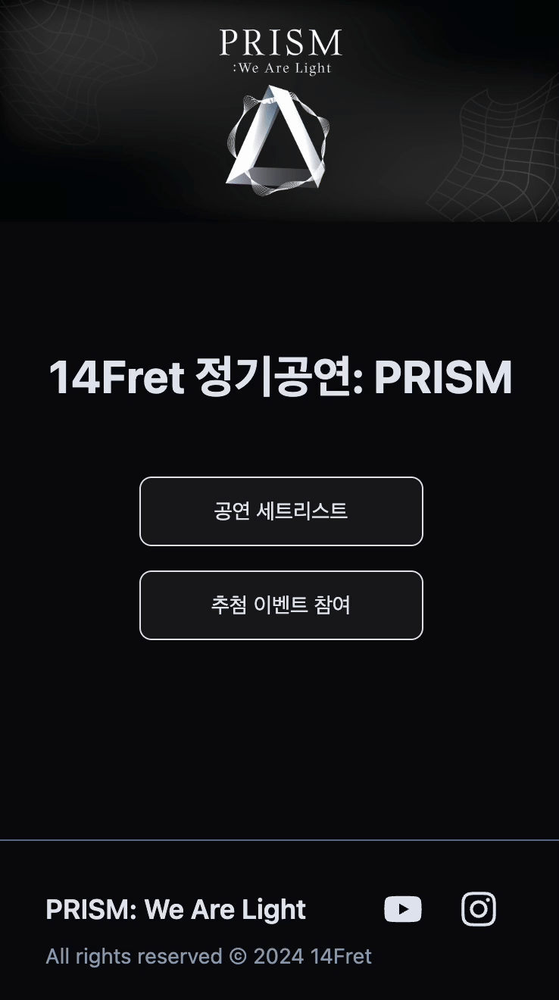
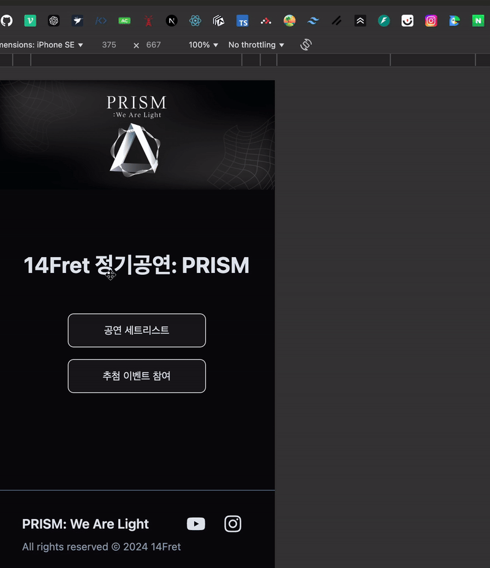

# QRFret 2024

광운대학교 중앙밴드동아리 14Fret 2024년도 정기공연 홈페이지 제작

---

## 개발에 사용한 기술

- Build/Bundler: `Vite`
- Library: `React`
- Language: `TypeScript`
- Routing: `React-Router`
- DB, Hosting: `Firebase`

---

## 프로젝트 소개

1. 이벤트 진행을 위한 추첨번호 발급/조회 페이지. 쿠키에 추첨번호를 저장. 중복 발급을 막기 위해 Firestore의 Transaction 활용.

2. 공연 세트리스트 확인 및 투표 페이지. 인당 최대 5번 투표 가능하도록 로컬 스토리지 활용.

   | **추첨번호 발급/조회 페이지** | **세트리스트 확인 및 투표 페이지** |
   | ----------------------------- | ---------------------------------- |
   |   |            |

3. 추첨번호와 투표현황을 확인할 수 있는 관리자 페이지. 로고를 빠르게 10번 클릭 후 비밀번호를 입력해야 접근 가능하도록 protected route 처리.
   

---
